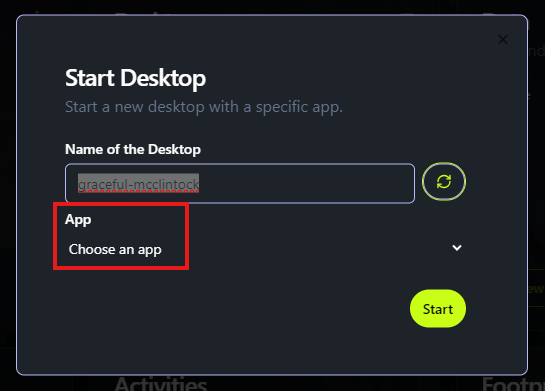
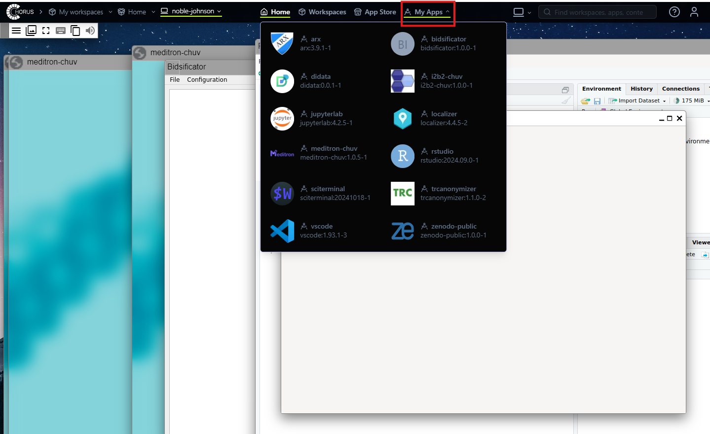

# Start an App

CHORUS provides access to a wide range of **research applications**, including data management tools, statistical analysis software, and AI-based solutions. Applications can be started in two ways:

**Option 1: Launching an App with a New Desktop**

When you create a new desktop, you can select an application before launching it. Once the desktop starts, the chosen app will be preloaded and ready for use.

**Option 2: Starting an App in an Existing Desktop**

If you already have a desktop running, you can launch additional applications within it:

1.	Open your active desktop.
2.	Navigate to the My Apps tab.

3.	Select the application you want to use, and it will open within your desktop.