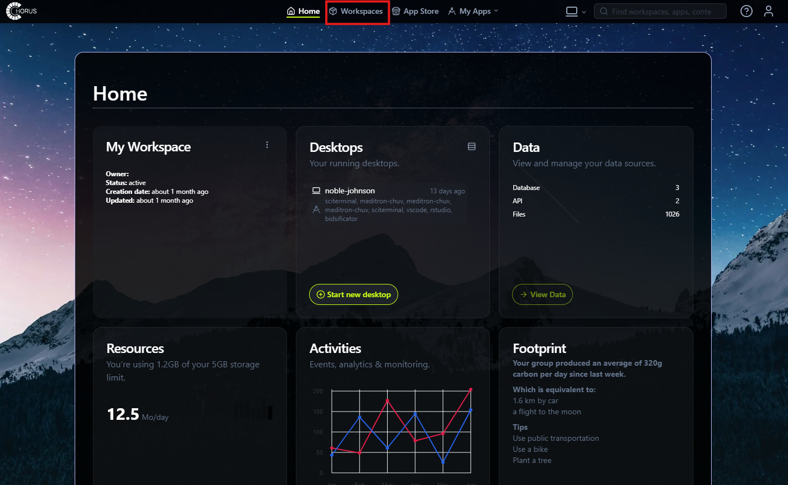
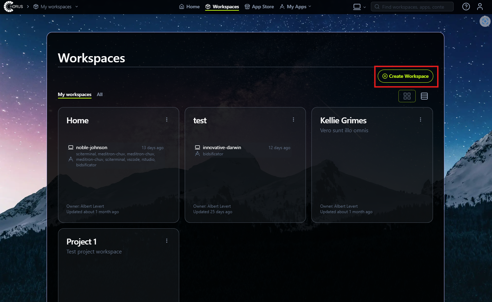
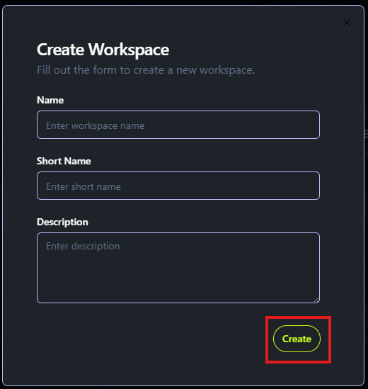

# Create a Workspace

Workspaces in CHORUS serve as **secure sandboxes** for managing research projects. Each workspace has specific security and privacy settings based on its governance policies, ensuring compliance with ethical and legal requirements.
Within a workspace, you can **collaborate with team members, manage datasets, and access specialized research tools** tailored to your project’s needs. Workspaces provide an organized and secure environment, making it easier to track progress, maintain compliance, and streamline research workflows.

To create a new workspace:

1.	Click on the Workspaces tab in your home workspace.

2.	Select Create Workspace.

3.	Enter the workspace details, including its name, description, and governance settings.

4.	Click Create, and your new workspace will be set up.

