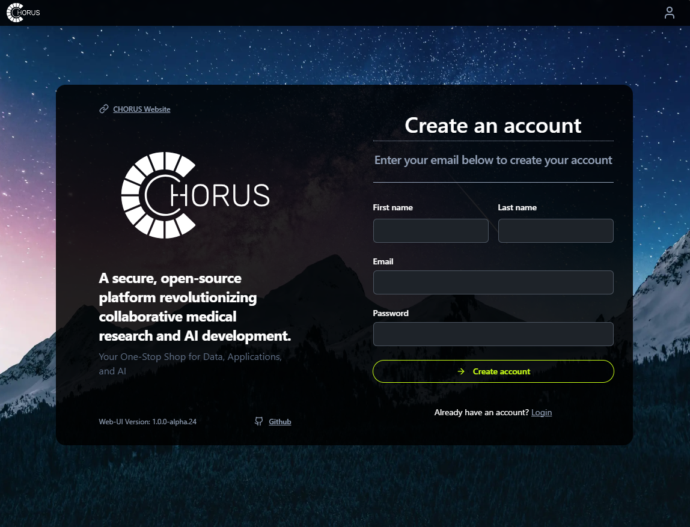
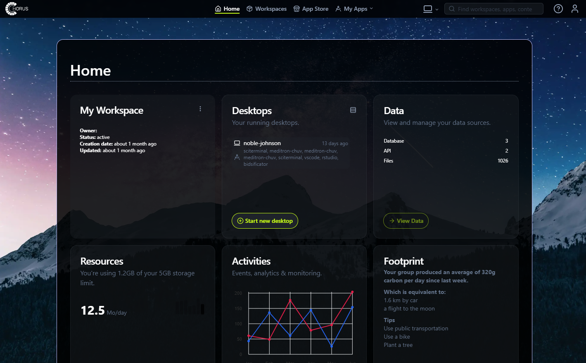

# Home Workspace

Your **Home Workspace** is the starting point for your CHORUS experience. It provides a personal dashboard where you can manage your work, access datasets, and monitor your resources.

Designed for efficiency and organization, it provides an overview of your active desktops, running applications, and available datasets. You can track your usage, view recent activities, and seamlessly navigate to project workspaces and browse available Applications.

To get started, go to [CHORUS-TRE · GitHub](https://github.com/CHORUS-TRE) and either log in or register for an account. If you're a new user, you'll need to complete a simple registration form. 

Once submitted, your account will be activated after validation by the CHORUS support team. After approval, you can log in with your credentials.

Upon logging in, you will land on your Home Workspace, where you’ll find:
- An overview of your active desktops and running applications
- A list of datasets you have access to
- Information on your current resource usage
- Your recent activities and research footprint

