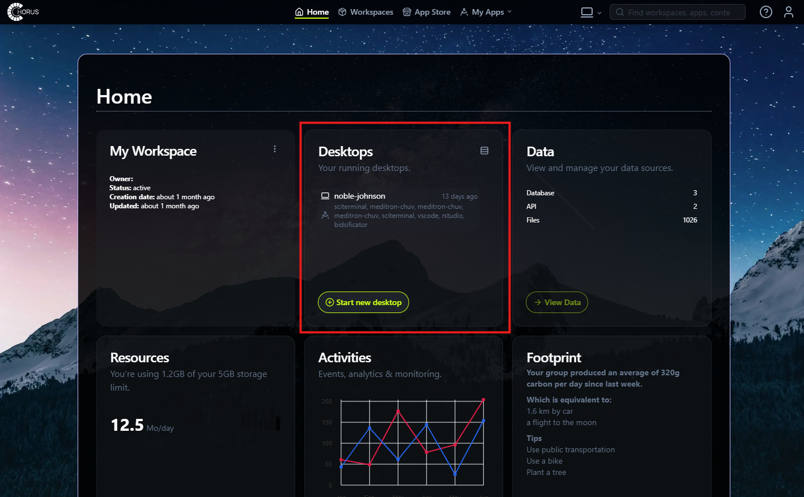
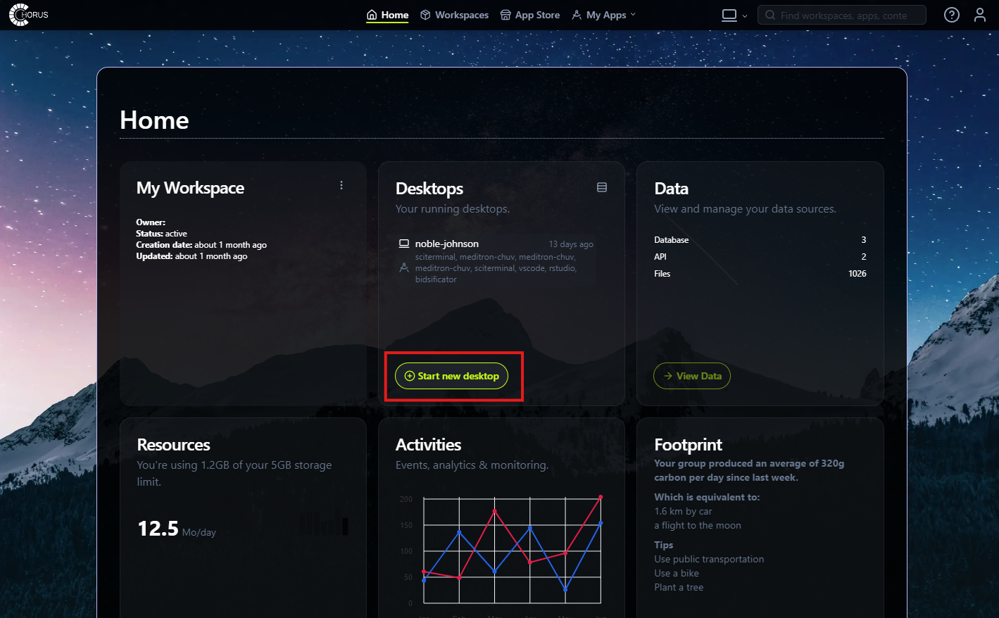
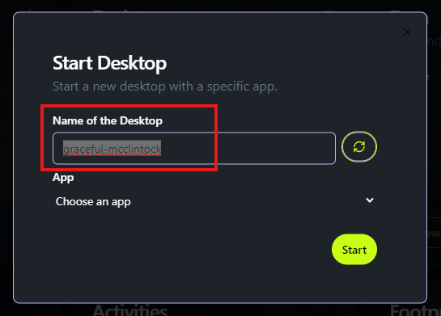
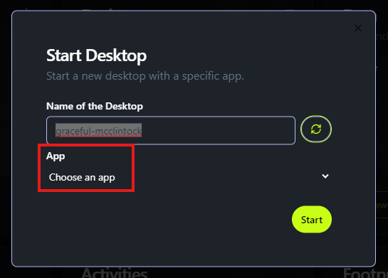
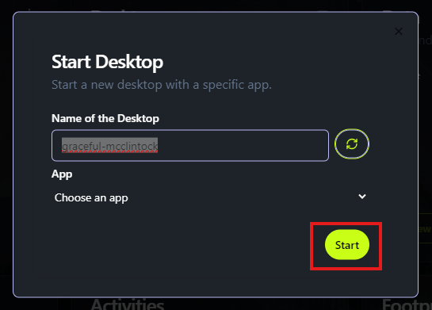

# Launch a Desktop

Desktops in CHORUS provide **a secure computing environment** where you can run applications, analyze data, and collaborate with others. You can launch a desktop in your Home Workspace or within a project workspace you are involved in.

With **flexible and scalable** resources, desktops can be customized to meet your project’s specific needs. You can also open **multiple instances simultaneously**, enabling you to manage different research tasks in parallel.

To start a new desktop:

1.	Go to your workspace and locate the Desktop block.

2.	Click on Start New Desktop.

3.	Provide a name for your desktop or use the default name suggested.

4.	Select an application you would like to use within the desktop.

5.	Click Start, and your desktop will launch with the selected app ready to use.

